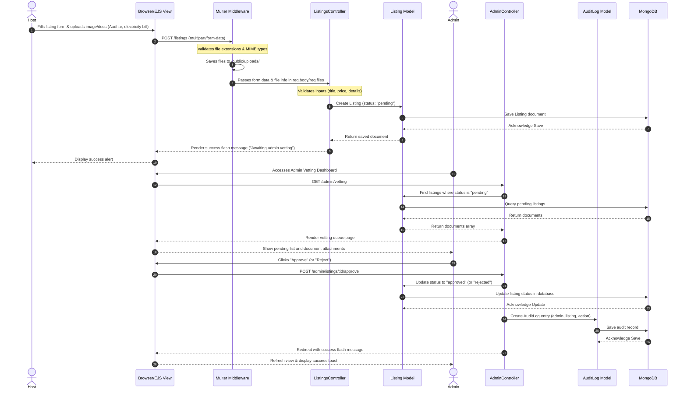
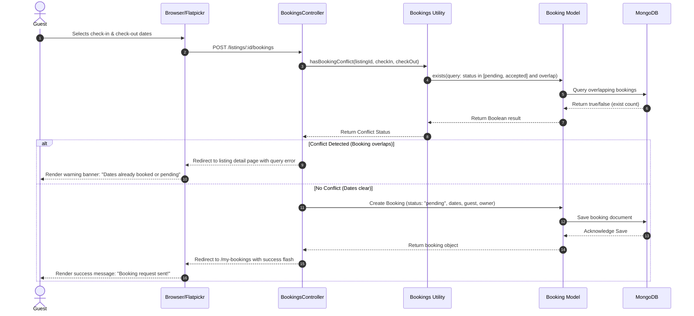

# Nestify - Accomodation Booking Platform Project Report

## TABLE OF CONTENTS

| Chapter | Content | Page No |
| :--- | :--- | :--- |
| **Chapter 1** | **Introduction** | **1 – 4** |
| | 1.1 Problem Statement | 1 |
| | 1.2 Objectives | 2 |
| | 1.3 Scope | 3 – 4 |
| **Chapter 2** | **Design** | **5 – 14** |
| | 2.1 System Architecture | 5 – 9 |
| | 2.2 Database Design | 10 – 14 |
| **Chapter 3** | **Implementation** | **15 – 17** |
| | 3.1 Frontend Development | 15 |
| | 3.2 Backend Development | 15 – 16 |
| | 3.3 Integration | 17 |
| **Chapter 4** | **Testing** | **18 – 20** |
| | 4.1 Test Cases | 18 – 19 |
| | 4.2 Results | 20 |
| **Chapter 5** | **Conclusion** | **21** |
| | 5.1 Summary | 21 |
| | 5.2 Future Enhancements | 21 |
| **Chapter 6** | **References** | **22** |
| **Chapter 7** | **Appendices** | **23 – 37** |
| **Chapter 8** | **Annexure - Progress Sheet** | **38** |

---

## CHAPTER 1: INTRODUCTION

### 1.1 Problem Statement
*(Page 1)*

The modern hospitality and travel sector has undergone a massive digital transformation, led by global aggregators. However, these mainstream lodging platforms have gradually shifted away from their founding principles of offering accessible, community-based, and highly affordable shared living spaces. This shift has resulted in several distinct challenges that travelers, hosts, and platform administrators encounter today:

1. **Escalating Costs of Travel Lodging:** Mainstream accommodation platforms have increasingly commercialized their inventory, prioritizing premium hotels, entire apartments, and vacation rentals. This has led to a lack of budget-friendly, local-feel shared accommodation alternatives, pricing out students, solo backpackers, and low-income travelers.
2. **Underutilized Residential Resources:** Local homeowners with empty spare rooms or underutilized household environments lack a trusted, streamlined platform to list their shared spaces. They have no simple mechanism to monetize these empty areas and gain supplemental income while welcoming cultural exchanges.
3. **Deficiency in Female-Centric Safety Protections:** Solo female travelers face safety concerns when navigating budget accommodations. Traditional booking systems feature generic reviews that rarely isolate safety parameters. There is a critical lack of validated, tamper-proof reviews that evaluate safety metrics (e.g., lighting, host behavior, neighborhood safety, lock secureness) contributed exclusively by female travelers who have actually stayed at the venue.
4. **Unregulated Listing Authenticity & Lack of Verification:** The proliferation of fraudulent accommodation listings has degraded traveler trust. Many platforms allow hosts to list properties without administrative validation of property ownership or identity. There is an urgent need for robust backend vetting workflows where hosts must submit documents (e.g., identity cards, utility bills, and sales deeds) before their properties become publicly bookable.
5. **Absence of Standardized Sustainability Disclosures:** Although travelers are increasingly eco-conscious, lodging platforms do not offer structured metrics to quantify a property's green credentials. There is an absence of verified eco-scorecards tracking key parameters like solar panel usage, waste segregation, rainwater harvesting, and energy efficiency.
6. **Fragmented Access to Local Services:** Travelers often struggle to find supplementary amenities (e.g., tour guides, local drivers, or home cooks) vetted by the community. These services are typically listed on separate directories, reducing convenience.

Nestify is developed to address these specific gaps by integrating a secure shared-accommodation booking system with key community modules: administrative document vetting, verified female safety metrics, structured environmental sustainability scores, and a localized services marketplace.

---

### 1.2 Objectives
*(Page 2)*

The primary objective of this project is to develop Nestify, an end-to-end community-driven accommodation booking platform built on the MERN stack. The detailed system objectives are:

*   **Establish a Robust MVC Architecture:** Design and deploy a scalable Model-View-Controller backend codebase in Node.js and Express.js, maintaining a strict separation of concerns between Mongoose schemas (Model), EJS-mate layouts (View), and controller routers (Controller).
*   **Create a Bidirectional User-Listing Economy:** Build an interface allowing local hosts to create listing profiles, upload descriptive text, define pricing, set maximum occupancy constraints, tag property categories (`normal` vs. `shared`), specify available meals (`veg` or `nonveg`), and define meal options (`breakfast`, `lunch`, `dinner`).
*   **Enforce Trust via Admin Vetting & Audit Logging:** Provide administrative portals to manage listings. Develop a document uploading module utilizing Multer, requiring hosts to submit Aadhar cards, electricity bills, or sales deeds. Admins must review these uploads, approve or reject listings, record reasons for rejection, and write detailed records to an automated, immutable `AuditLog` collection.
*   **Develop a Verified Women's Safety Rating System:** Implement a tamper-proof rating engine that accepts safety ratings (1-5 scale) and tags (neighborhood safety, lock/privacy, host behavior, transport access, lighting) only if the user is registered as female and holds an accepted, completed booking at that listing.
*   **Implement a Sustainability Rating Engine:** Implement a mathematical scoring mechanism that processes listing eco-features (solar energy, waste segregation, rainwater harvesting, energy-efficient appliances, public transport access, and water-saving fixtures) to yield a standardized rating out of 5 stars, backed by admin document verification.
*   **Build a Localized Services Marketplace:** Implement a community services directory enabling local service providers to advertise local tours, driving, or domestic help. The directory must handle location query parameters (city, state, country) to show nearby service listings to guests.
*   **Enforce Booking Collision Avoidance:** Write algorithms that intercept booking requests and prevent double-booking of properties for overlapping date selections.

---

### 1.3 Scope
*(Pages 3 – 4)*

The scope of the Nestify platform is categorized into user roles, functional modules, and system boundaries:

#### 1. User Roles and Privileges
*   **Guest (Traveler):** Searches listings by city, date ranges, and sustainability categories. Books rooms, tracks booking history (upcoming vs. past), leaves standard reviews, and leaves verified women's safety ratings (restricted to female users).
*   **Host (Homeowner):** Creates and edits property listings, uploads listing images and government documents, manages listing categories, and reviews incoming bookings (pending, accepted, rejected, cancelled). Hosts can also register community services in the marketplace.
*   **Admin / Super-Admin:** Reviews hosts' verification documents, approves or rejects listings, manages sustainability scores, and reviews the system audit trails.

#### 2. Functional Modules
*   **Authentication & Session Management:** Handles registration, password hashing, and user sessions using Passport.js and `express-session`.
*   **Listing Management System:** Supports creation, updating, and deletion of listings. Integrates Multer middleware to process multiple image uploads and document verification files.
*   **Booking Conflict Resolution Engine:** Restricts booking submissions to available dates by cross-checking date ranges.
*   **Women's Safety Rating:** Restricts input forms to verified female guests, updating average ratings via MongoDB aggregations.
*   **Sustainability Score Calculator:** Calculates and displays a 0-5 rating based on a checked set of verified eco-credentials.
*   **Services Directory:** Provides categories (`tour guide`, `Driver`, `House Help`) with matching location parameters.

```
+-----------------------------------------------------------------------------------+
|                                  NESTIFY SYSTEM                                   |
+-----------------------------------------------------------------------------------+
|                                                                                   |
|  [Guest Interface]  <===>  [Express Controllers]  <===>  [Mongoose Schemas]        |
|  - Search Listings         - isLoggedIn Middleware        - Users (Passport)      |
|  - Book (Flatpickr)        - isOwner Middleware           - Listings & Bookings   |
|  - Rate Women Safety       - Booking Conflict Checker     - Reviews & Services    |
|  - View Eco-Score          - Sustainability Calculator    - AuditLogs             |
|                                                                                   |
|                                         ^                                         |
|                                         |                                         |
|                                         v                                         |
|                                                                                   |
|  [Host Dashboard]   <===>  [Multer File Uploads]  <===>  [Admin Control Panel]    |
|  - Add Listings            - Local uploads to             - Review Documents      |
|  - Upload Aadhar           - public/uploads/              - Approve / Reject      |
|  - Manage Bookings         - Allowed: images, pdfs        - Audit Log Viewer      |
|                                                                                   |
+-----------------------------------------------------------------------------------+
```

#### 3. System Boundaries and Limitations
*   **Manual Verification:** The system relies on manual admin assessment of uploaded document images and PDFs; automatic document scanning (OCR) is excluded from the current scope.
*   **Simulated Payment Transactions:** Financial transactions are simulated using pending-accepted status flows. Integration with live payment processors (Stripe or Razorpay) is excluded.
*   **Local File Storage:** Uploaded files are saved to the server's local directory (`public/uploads/`). External cloud storage (e.g., Cloudinary, AWS S3) is defined as a future extension.
*   **Communication:** Interactions between guests and hosts are handled via booking status changes. Direct real-time chat is excluded from the initial release.

---

## CHAPTER 2: DESIGN

### 2.1 System Architecture
*(Pages 5 – 9)*

Nestify is designed around the **Model-View-Controller (MVC)** software architectural pattern. This pattern separates data management, presentation layouts, and application controller logic into distinct components, enhancing maintenance, security, and scalability.

```
                     +----------------------------------------+
                     |                 Browser                |
                     |  (HTML5, Bootstrap 5, Vanilla CSS, JS) |
                     +----------------------------------------+
                                 |                ^
                HTTP Requests    |                | HTML / EJS Render
                (POST/GET/PUT/..) |                |
                                 v                |
                     +----------------------------------------+
                     |           Express.js Routes            |
                     |       (users, listings, bookings)      |
                     +----------------------------------------+
                                         |
                                         v
                     +----------------------------------------+
                     |           Express Middleware           |
                     |  (isLoggedIn, isOwner, validateSchema) |
                     +----------------------------------------+
                                         |
                                         v
                     +----------------------------------------+
                     |          Express Controllers           |
                     |       (listings.js, bookings.js)       |
                     +----------------------------------------+
                                    /          \
                     Read/Write    /            \   Read/Write
                                  v              v
                     +-----------------+    +-----------------+
                     |  Mongoose Model |    |  Mongoose Model |
                     |   (Listing)     |    |   (Booking)     |
                     +-----------------+    +-----------------+
                                  \              /
                        Mongoose   \            /   Mongoose
                        Operations  v          v    Operations
                     +----------------------------------------+
                     |             MongoDB Database           |
                     |  (User, Listing, Booking, Review,      |
                     |   Service, AuditLog collections)       |
                     +----------------------------------------+
```

#### 1. Architectural Layers

*   **The Data Access Layer (Model):** Built using Mongoose ODM running on MongoDB. It defines the structural layout, default values, schemas, validation rules, and indexes of collections. References are maintained using MongoDB `ObjectId` types to link collections (such as matching a Booking to a Listing and a User).
*   **The Presentation Layer (View):** Developed using Embedded JavaScript (EJS) templates. The user interface uses `ejs-mate` to support boilerplate layouts (`boilerplate.ejs` and `authBoilerplate.ejs`), partials (`navbar.ejs`, `footer.ejs`, and `listing-filters.ejs`), and block variables. Styling is written using Bootstrap 5 and custom CSS (`style.css`), supporting dark/light display modes toggled via client-side JavaScript (`theme-toggle.js`).
*   **The Business Logic Layer (Controller):** Implemented in Node.js and Express.js. Controllers process business logic, run database queries, handle state, and render views or redirect paths. Routes are categorized into separate modules (`routes/listings.js`, `routes/bookings.js`, `routes/services.js`, `routes/users.js`, `routes/admin.js`).

#### 2. System Activity and Data Flows

##### A. User Authentication Flow
1.  A user submits their email and password through the registration or login forms.
2.  The Express route passes the payload to Passport.js.
3.  Passport.js authenticates the credentials against the hashed password stored in the MongoDB `User` collection.
4.  Upon successful validation, a session is initialized using `express-session` and saved in cookie storage. The application attaches the authenticated user instance to `res.locals.currUser` for view accessibility.

##### B. Listing Submission and Vetting Flow
1.  A Host fills out listing details, selects sustainability features, and uploads images and verification documents (Aadhar, electricity bill, sales deed).
2.  The request is intercepted by Multer, which validates file extensions and MIME types, writes files to `/public/uploads/`, and adds file metadata to the request object.
3.  The controller constructs a new `Listing` document with a `pending` status.
4.  An Admin logs into the admin portal, reviews the host's uploaded documents, and approves or rejects the listing.
5.  If approved, the listing's status changes to `approved`, making it searchable by guests. An entry is generated in the `AuditLog` collection.

##### C. Booking and Collision Prevention Flow
1.  A Guest selects check-in and check-out dates using the Flatpickr calendar.
2.  The controller triggers the booking conflict validator (`hasBookingConflict`). It queries the database to find bookings with status `pending` or `accepted` where:
    $$\text{checkIn} < \text{requestedCheckOut} \quad \text{and} \quad \text{checkOut} > \text{requestedCheckIn}$$
3.  If a conflict is identified, the transaction is aborted, and the user is redirected with an error message.
4.  If dates are clear, a new booking is created with status `pending`.
5.  The Host reviews the booking. Accepting it locks the dates and automatically updates all other conflicting pending bookings for that listing to `rejected`.

#### 3. Activity Diagram (System Workflows)
Below are the workflow specifications for rendering the Nestify Activity Diagram. The workflow models the system logic from initial launch, registration checks, and role split (Guest, Host, Admin) through their respective operational pipelines, merging at the logout synchronization bar.

##### A. Swimlanes and Actor Responsibilities
*   **Guest (Traveler):** Performs search operations, filters listings by category or eco-friendly parameters, selects check-in/out dates, submits booking requests, completes stays, leaves ratings (with exclusive safety rating form for females), and extracts booking receipts.
*   **Host (Property Owner):** Registers and updates properties, uploads mandatory identity/property proof documents, reviews guest bookings (accepting locks the dates and rejects duplicates), and lists local services (driving, guiding, house help) in the marketplace.
*   **Admin (System Moderator):** Accesses document queues, verifies host identity and eco-documents, registers approvals/rejections, calculates/verifies environmental scores, and monitors logs in the Audit Dashboard.

##### B. Step-by-Step Flow Specification
1.  **System Entry:** User launches application -> Decision: "Already Registered?"
    *   *No:* Diverge to **Register Account Form** (inputs name, email, password, gender, phone) -> Proceed to Login.
    *   *Yes:* Proceed directly to **Login Form** (inputs email and password credentials).
2.  **Role Verification:** Session initialized -> Check user role in database.
    *   *Role = Guest:* Route to Guest Dashboard.
    *   *Role = Host:* Route to Host Dashboard.
    *   *Role = Admin:* Route to Admin Dashboard.
3.  **Guest Pipeline:**
    *   Guest Dashboard -> Search Listings (inputs location, dates, features) -> View Listing Details page.
    *   Click Book Room -> Decision: "Dates Available (Booking Conflict Validator)?"
        *   *No:* Re-select dates or search again.
        *   *Yes:* Submit Booking Request (status sets to `pending`).
    *   Wait for Host Action -> Decision: "Stay Completed?"
        *   *Yes:* Decision: "Is Guest Gender Female?"
            *   *Yes:* Render verified Women Safety Rating form + Standard Review form.
            *   *No:* Render Standard Review form only.
        *   *No / Upcoming:* Access booking history list -> Download Booking Summary (receipt).
4.  **Host Pipeline:**
    *   Host Dashboard -> Create Listing (specifies meals, category, max guests) -> Upload Documents (Aadhar Card, Electricity Bill, Sales Deed, Eco Evidence).
    *   Submit Listing -> Decision: "Listing Approved by Admin?"
        *   *No / Rejected:* View rejection reason -> Modify Listing details -> Re-submit for review.
        *   *Yes / Approved:* Listing goes live on the platform.
    *   Manage Bookings -> View pending requests -> Decision: "Accept Booking?"
        *   *Yes:* Accept Booking (status updates to `accepted`, dates locked, and overlapping bookings auto-rejected).
        *   *No:* Reject Booking (status updates to `rejected`, dates released).
    *   Marketplace Management -> Register Local Service (tour guide, driver, help) with location criteria.
5.  **Admin Pipeline:**
    *   Admin Dashboard -> Vetting Queue -> Download and Inspect Host Identity & Eco Documents.
    *   Decision: "Documents Valid & Authentic?"
        *   *No:* Reject Listing -> Input Rejection Reason -> Log in `AuditLog` -> Update status.
        *   *Yes:* Approve Listing -> Calculate and verify Sustainability Score -> Log in `AuditLog` -> Publish Listing.
    *   Access platform registries (Manage Users, Listings, Services) and view Audit Logs.
6.  **Termination & Exit:** All branches merge at the synchronization join bar -> Log Out (destroys session) -> End State.

##### C. Diagram Definition (Mermaid.js Flowchart)

```mermaid
graph TD
    %% Base Flow
    StartNode([● START]) --> OpenSys[User Opens Nestify System]
    OpenSys --> RegCheck{Already Registered?}
    
    RegCheck -- No --> RegisterPage[Register Account]
    RegisterPage --> LoginPage[Login]
    RegCheck -- Yes --> LoginPage
    
    LoginPage --> RoleCheck{Check User Role}

    %% Guest Swimlane
    RoleCheck -- "Guest (Traveler)" --> GuestDash[Guest Dashboard]
    GuestDash --> SearchFilter[Search & Filter Listings]
    SearchFilter --> ViewListing[View Listing Details & Ratings]
    ViewListing --> SelectDates[Select Dates via Flatpickr]
    
    SelectDates --> ConflictCheck{Dates Available?}
    ConflictCheck -- No --> SelectDates
    ConflictCheck -- Yes --> ReqBooking[Submit Booking Request]
    
    ReqBooking --> AwaitHost[Awaits Host Confirmation]
    AwaitHost --> StayCheck{Stay Completed?}
    
    StayCheck -- No --> ViewHistory[View Booking History]
    StayCheck -- Yes --> GenderCheck{Is Guest Female?}
    
    GenderCheck -- Yes --> LeaveWomenRating[Leave Verified Women Safety Rating & Standard Review]
    GenderCheck -- No --> LeaveStdReview[Leave Standard Review & Comment]
    
    LeaveWomenRating --> DownloadRec[Download Booking Summary / Receipt]
    LeaveStdReview --> DownloadRec
    ViewHistory --> DownloadRec
    DownloadRec --> SyncJoin

    %% Host Swimlane
    RoleCheck -- "Host (Owner)" --> HostDash[Host Dashboard]
    HostDash --> AddListingForm[Create New Property Listing]
    AddListingForm --> UploadDocs[Upload Verification Docs & Sustainability Evidence]
    UploadDocs --> SubmitVetting[Submit Listing for Admin Review]
    
    SubmitVetting --> VetCheck{Listing Vetted?}
    VetCheck -- No / Rejected --> EditListing[Review Reason, Edit & Re-submit]
    EditListing --> SubmitVetting
    VetCheck -- Yes / Approved --> ListingPublished[Listing Published & Searchable]
    
    ListingPublished --> ViewRequests[View Incoming Booking Requests]
    ViewRequests --> BookingDecision{Accept Reservation?}
    
    BookingDecision -- Yes --> AcceptBook[Accept Booking: Lock Dates & Auto-Reject Overlaps]
    BookingDecision -- No --> RejectBook[Reject Booking: Release Dates]
    
    AcceptBook --> RegisterService[Register Service in Marketplace]
    RejectBook --> RegisterService
    RegisterService --> SyncJoin

    %% Admin Swimlane
    RoleCheck -- "Admin (Moderator)" --> AdminDash[Admin Dashboard]
    AdminDash --> VettingQueue[Access Pending Vetting Queue]
    VettingQueue --> InspectDocs[Inspect Identity & Sustainability Documents]
    
    InspectDocs --> DocCheck{Documents Valid?}
    DocCheck -- No --> RejectAdmin[Reject Listing & Log Audit Log Entry]
    DocCheck -- Yes --> ApproveAdmin[Approve Listing, Save Eco Score & Log Audit Log Entry]
    
    RejectAdmin --> ManageReg[Manage Platform Registries & Audit Logs]
    ApproveAdmin --> ManageReg
    ManageReg --> SyncJoin

    %% Shared Logout & Termination
    SyncJoin[======================= SYNCHRONIZATION JOIN =======================] --> LogoutNode[Log Out & Clear Session]
    LogoutNode --> EndNode([⦿ END])

    %% Styling
    style StartNode fill:#333,stroke:#333,stroke-width:2px;
    style EndNode fill:#333,stroke:#333,stroke-width:2px;
    style SyncJoin fill:#444,stroke:#333,stroke-width:1px;
```

#### 4. Sequence Diagrams (Component Messaging)
The following sequence diagrams model the time-ordered interactions between system actors, controllers, middlewares, models, and the database for two core system operations.

##### A. Property Listing Submission and Vetting Flow
This diagram illustrates the process of a Host uploading properties and vetting documents, and an Admin auditing the registration and logging activities in the system audit logs.



##### B. Booking Request with Collision Prevention Flow
This diagram illustrates the transaction pipeline where the system validates check-in/out dates, queries MongoDB for overlapping bookings, and manages the booking state.



---

### 2.2 Database Design
*(Pages 10 – 14)*

Nestify uses MongoDB as its primary datastore, structured via Mongoose schemas. Below are the design specifications of the database schemas, references, and validation rules.

#### 1. Mongoose Schema Definitions

##### A. User Collection Schema (`user.js`)
*   **username:** `String` (Required, trimmed, minimum 3 characters)
*   **email:** `String` (Required, unique, lowercase, validated format)
*   **profileImage:** `Object` (Default: `{ url: "/uploads/icon.png", filename: "icon.png" }`)
*   **gender:** `String` (Enum: `["female", "male", "other", "prefer-not-to-say"]`, default: `"prefer-not-to-say"`)
*   **phoneNumber:** `String` (Validated 10-digit numeric string)
*   *Note:* Integrates `passport-local-mongoose` with `email` defined as the username lookup field.

##### B. Admin Collection Schema (`admin.js`)
*   **username:** `String` (Required, trimmed)
*   **email:** `String` (Required, unique, lowercase)
*   **role:** `String` (Enum: `["super-admin", "admin"]`, default: `"admin"`)
*   **createdBy:** `ObjectId` (Refers to another Admin document)
*   *Note:* Integrates `passport-local-mongoose` for admin-specific portals.

##### C. Listing Collection Schema (`listing.js`)
*   **title:** `String` (Required, trimmed, minimum 3 characters)
*   **description:** `String` (Required, minimum 10 characters)
*   **image:** `Object` (Cover image with `url` and `filename` keys)
*   **images:** `[Object]` (Array of supplementary image objects)
*   **category:** `String` (Enum: `["normal", "shared"]`, default: `"normal"`)
*   **meals:**
    *   **types:** `[String]` (Enum options: `"veg"`, `"nonveg"`)
    *   **options:** `[String]` (Enum options: `"breakfast"`, `"lunch"`, `"dinner"`)
*   **maxGuests:** `Number` (Minimum: 1, default: 1)
*   **price:** `Number` (Required, positive number)
*   **location:** `String` (Required)
*   **city:** `String` (Required)
*   **state:** `String` (Required)
*   **country:** `String` (Required)
*   **status:** `String` (Enum: `["pending", "approved", "rejected"]`, default: `"pending"`)
*   **sustainabilityRating:** `Number` (Range: 0-5, default: 0)
*   **sustainabilityChecklist:**
    *   `hasSolar` (`Boolean`), `wasteSegregation` (`Boolean`), `rainwaterHarvesting` (`Boolean`), `energyEfficientAppliances` (`Boolean`), `publicTransportAccess` (`Boolean`), `waterSavingFixtures` (`Boolean`)
*   **sustainabilityEvidence:** `[Object]` (Upload details for verification documents)
*   **sustainabilityVerified:** `Boolean` (Default: `false`)
*   **reviewRating:** `{ average: Number, count: Number }`
*   **womenSafetyRating:**
    *   **average:** `Number`
    *   **count:** `Number`
    *   **ratings:** Array of:
        *   `user` (`ObjectId`, ref: `"User"`)
        *   `booking` (`ObjectId`, ref: `"Booking"`)
        *   `rating` (`Number`, 1-5 scale)
        *   `tags`: `{ lighting: Boolean, hostBehavior: Boolean, neighborhood: Boolean, privacy: Boolean, transportAccess: Boolean }`
        *   `createdAt` (`Date`)
*   **documents:** `{ aadharCard: Object, electricityBill: Object, salesDeed: Object }`
*   **reviewedBy:** `ObjectId` (Ref: `"Admin"`)
*   **reviewedAt:** `Date`
*   **rejectionReason:** `String` (Trimmed, default: `""`)
*   **UserID:** `ObjectId` (Ref: `"User"`, identifies Listing owner)

##### D. Booking Collection Schema (`booking.js`)
*   **listing:** `ObjectId` (Ref: `"Listing"`, Required)
*   **guest:** `ObjectId` (Ref: `"User"`, Required)
*   **owner:** `ObjectId` (Ref: `"User"`, Required)
*   **checkIn:** `Date` (Required)
*   **checkOut:** `Date` (Required)
*   **listingTitle:** `String`
*   **pricePerNight:** `Number`
*   **nights:** `Number`
*   **totalPrice:** `Number`
*   **guestCount:** `Number` (Minimum: 1, default: 1)
*   **status:** `String` (Enum: `["pending", "accepted", "rejected", "cancelled"]`, default: `"pending"`)
*   **womenSafetyRating:** `Number` (Range: 1-5)
*   **womenSafetyTags:** `{ lighting: Boolean, hostBehavior: Boolean, neighborhood: Boolean, privacy: Boolean, transportAccess: Boolean }`
*   **propertyReview:** `ObjectId` (Ref: `"Review"`)
*   **reviewedAt:** `Date`
*   **timestamps:** `true` (Automatically logs `createdAt` and `updatedAt`)

##### E. Review Collection Schema (`review.js`)
*   **listing:** `ObjectId` (Ref: `"Listing"`, Required)
*   **booking:** `ObjectId` (Ref: `"Booking"`, Required, Unique index to prevent duplicates)
*   **user:** `ObjectId` (Ref: `"User"`, Required)
*   **rating:** `Number` (Required, Range: 1-5)
*   **comment:** `String` (Trimmed, default: `""`)
*   **timestamps:** `true`

##### F. Service Collection Schema (`service.js`)
*   **name:** `String` (Required, trimmed)
*   **category:** `String` (Enum: `["tour guide", "Driver", "House Help"]`, Required)
*   **phone:** `String` (Required, unique, validated 10-digit string)
*   **photo:** `{ url: String, filename: String }`
*   **location:** `String` (Required, trimmed)
*   **city:** `String` (Required, trimmed)
*   **country:** `String` (Required, trimmed)
*   **owner:** `ObjectId` (Ref: `"User"`, Required)
*   **timestamps:** `true`

##### G. AuditLog Collection Schema (`auditLog.js`)
*   **admin:** `ObjectId` (Ref: `"Admin"`, Required)
*   **listing:** `ObjectId` (Ref: `"Listing"`, Required)
*   **action:** `String` (Enum: `["approved", "rejected"]`, Required)
*   **reason:** `String` (Trimmed, default: `""`)
*   **metadata:** `Object` (Default: `{}`)
*   **timestamps:** `true`

---

## CHAPTER 3: IMPLEMENTATION

### 3.1 Frontend Development
*(Page 15)*

#### 1. Authentication Module
The Authentication Module handles account registration, secure login, and session preservation for both regular users (guests/hosts) and administrators.

**Features:**
* Secure registration for new hosts and guests
* Login functionality with password authentication
* Role-based redirections (Admin vs. Standard User)
* Persistent sessions and secure logout
* Session authentication middleware (`isLoggedIn`)

**Frontend Components:**
* Login Page (`login.ejs`)
* Registration Page (`signup.ejs`)
* Persistent Navigation header changes based on session state

**Technologies Used:**
* HTML5 Forms
* Bootstrap 5 styling
* Passport.js (local strategy)
* Express Session middleware

#### 2. Listing Module
The Listing Module allows hosts to create and manage their shared accommodations, and allows guests to discover them.

**Features:**
* Accommodation creation (specifying title, price, location, meals, category, max guests)
* Update and delete functions for property owners
* Document uploads (Aadhar, electricity bills, sales deeds) for property validation
* Sustainability checklist scoring system (0-5 stars)
* Search and category filtering (e.g. shared accommodations)

**Frontend Components:**
* Listings Showcase/Home Page (`index.ejs`)
* Listing Detail View (`show.ejs`)
* Listing Creation Form (`new.ejs`)
* Listing Editing Workspace (`edit.ejs`)
* Category filter tabs and eco-rating badge

**Technologies Used:**
* Multer upload middleware
* Bootstrap 5 Grid layout
* Mongoose schema validations
* FontAwesome icons for sustainability rating displays

#### 3. Booking Module
The Booking Module manages accommodation bookings, prevents overlapping reservations, and lets hosts accept/reject requests.

**Features:**
* Dynamic booking request submission for verified dates
* Overlapping date check to avoid double-bookings
* Booking status update notification (Pending, Accepted, Rejected, Cancelled)
* Automated cancellation of overlapping pending bookings when one is accepted

**Frontend Components:**
* Interactive check-in/out date calendars
* Guest Bookings dashboard (`my-bookings.ejs`)
* Host reservations control dashboard

**Technologies Used:**
* Flatpickr Calendar library
* Custom database transaction validators (`hasBookingConflict`)
* Mongoose query builders for date overlaps

#### 4. Services Module
The Services Module integrates local tour guides, transport drivers, and domestic help into a community services directory.

**Features:**
* Service listing registration for local service providers
* Location filtering matching listings by city/state/country
* Duplicate contact prevention (unique phone checks)

**Frontend Components:**
* Services marketplace directory (`index.ejs`)
* Service registration page (`new.ejs`)
* Location search filter bar

**Technologies Used:**
* Mongoose index schemas (unique constraints)
* Bootstrap flexbox cards
* Express query routing

#### 5. User Profile/Settings Module
The User Module gives hosts and guests control over their personal records, profile images, and login credentials.

**Features:**
* Update basic profile details (name, email, phone, gender)
* Change user profile image uploads
* Secure password updating requiring current credentials check

**Frontend Components:**
* Settings and update form page (`settings.ejs`)
* User profile overview dashboard
* Responsive image upload field

**Technologies Used:**
* Passport.js password changing API
* Multer image processing
* Flash notification messages

#### 6. Admin Module
The Admin Module provides the platform control panel for system verification and audit logging.

**Features:**
* Listing vetting queue showing unapproved listings
* Inspect-and-vet workspace for host document validations
* Sustainability score adjustment controls
* Immutable audit logger recording approval/rejection audits

**Frontend Components:**
* Admin Dashboard main page (`dashboard.ejs`)
* Listing Vetting workspace (`show.ejs` with vetting panels)
* System Audit Trails viewer table

**Technologies Used:**
* Admin authorization middleware (`isAdmin`)
* AuditLog mongoose schemas
* Express session admin id verification

---

### 3.2 Backend Development
*(Pages 15 – 16)*

The server-side structure uses a Node.js framework powered by Express.js routing. Key backend components include:

#### 1. Security and Router Middleware
*   **isLoggedIn / isUserLoggedIn:** Intercepts protected requests (e.g., creating a listing or booking a room) and confirms authorization. Unauthenticated requests are redirected with an error flash message.
*   **isAdmin / isSuperAdmin:** Restricts access to administrative endpoints, verifying authorization before rendering the admin dashboard.
*   **isListingOwnerOrAdmin:** Validates that the active session belongs to either the owner of the listing or an administrator before executing updates or deletion commands.
*   **Global Error Handling Middleware:** Configured in `app.js` to catch errors passed to `next(err)` and render `error.ejs` to keep the application running during runtime exceptions.

#### 2. Input Upload Processing
*   **Multer File Upload:** Configured with disk storage to write files to `/public/uploads/` with unique file suffixes:
    ```javascript
    const storage = multer.diskStorage({
        destination: (req, file, cb) => cb(null, uploadPath),
        filename: (req, file, cb) => {
            const uniqueSuffix = `${Date.now()}-${Math.round(Math.random() * 1E9)}`;
            cb(null, `${uniqueSuffix}${path.extname(file.originalname)}`);
        }
    });
    ```
    MIME checks filter uploads, restricting profile images and property listings to image formats (`image/jpeg`, `image/png`, `image/webp`), and vetting documents to images or PDF formats (`application/pdf`).

#### 3. Core Business Algorithms
*   **Booking Date Conflict Analysis:**
    ```javascript
    async function hasBookingConflict(listingId, checkIn, checkOut, excludedBookingId) {
        const query = {
            listing: listingId,
            status: { $in: ["pending", "accepted"] },
            checkIn: { $lt: checkOut },
            checkOut: { $gt: checkIn }
        };
        if (excludedBookingId) query._id = { $ne: excludedBookingId };
        return Boolean(await Booking.exists(query));
    }
    ```
*   **Sustainability Calculation Engine:**
    Calculates a rating out of 5 stars based on the checked proportion of the sustainability checklist:
    $$\text{Rating} = \text{Round}\left(\frac{\text{Checked Items}}{\text{Total Items}} \times 5 \times 10\right) / 10$$

---

### 3.3 Integration
*(Page 17)*

This section outlines how frontend and backend components are connected in the MERN application.

```
+---------------------------------------------------------------------------------+
|                                INTEGRATION LAYERS                               |
+---------------------------------------------------------------------------------+
|                                                                                 |
|   +-----------------------+                 +-------------------------------+   |
|   |    EJS Templates      |                 |       Express Controllers     |   |
|   |  - listings/index     |  POST/GET Forms |  - listings.js (Actions)      |   |
|   |  - bookings/owner     | ===============>|  - bookings.js (Validations)  |   |
|   |  - services/index     |                 |  - users.js (Signup/Login)    |   |
|   +-----------------------+                 +-------------------------------+   |
|               ^                                             |                   |
|               |                                             |                   |
|               | res.render()                                | Mongoose ODM      |
|               |                                             v                   |
|   +-----------------------+                 +-------------------------------+   |
|   |  Client Browser UI    |                 |        MongoDB Database       |   |
|   |  - flatpickr dates    | <===============|  - Users, Listings, Bookings  |   |
|   |  - theme-toggle state |   Render HTML   |  - Services, AuditLogs        |   |
|   +-----------------------+                 +-------------------------------+   |
|                                                                                 |
+---------------------------------------------------------------------------------+
```

1.  **Database Connection:** The entry point `app.js` reads variables from a `.env` file and connects to MongoDB using Mongoose:
    ```javascript
    mongoose.connect(process.env.MONGO_URL);
    ```
2.  **Authentication Integration:** Passport.js is registered on the Express instance, binding serialized user IDs to sessions:
    ```javascript
    app.use(passport.initialize());
    app.use(passport.session());
    passport.use(User.createStrategy());
    passport.serializeUser(User.serializeUser());
    passport.deserializeUser(User.deserializeUser());
    ```
3.  **Local Variables Middleware:** An Express interceptor populates local EJS scope on every request:
    ```javascript
    app.use(async (req, res, next) => {
        res.locals.currUser = req.user;
        res.locals.currAdmin = req.session.adminId ? await Admin.findById(req.session.adminId) : null;
        res.locals.flashSuccess = req.flash("success");
        res.locals.flashError = req.flash("error");
        next();
    });
    ```
4.  **Route Mounting:** Express routes are structured and mounted as middleware:
    ```javascript
    app.use("/admin", adminRoutes);
    app.use("/", userRoutes);
    app.use("/", bookingRoutes);
    app.use("/listings", listingRoutes);
    app.use("/services", serviceRoutes);
    ```

---

## CHAPTER 4: TESTING

### 4.1 Test Cases
*(Pages 18 – 19)*

The platform was evaluated using structured manual testing. Below are the key test cases for the functional modules.

#### 1. Authentication Module (Login / Signup)
| Testcase ID | Test Case Scenario | Input | Expected Output | Status |
| :--- | :--- | :--- | :--- | :--- |
| **TC-AUTH-01** | Successful Guest Signup | Valid unique email, username, password, gender, and Guest role. | Account created, session starts, user redirected to dashboard. | **Pass** |
| **TC-AUTH-02** | Successful Host Signup | Valid unique signup fields with Host role selection. | Account created, session starts, user redirected to dashboard. | **Pass** |
| **TC-AUTH-03** | Signup with duplicate Email | Attempt to register using an email already stored in MongoDB. | Signup fails, rendering a validation warning banner. | **Pass** |
| **TC-AUTH-04** | Signup with empty fields | Omit mandatory fields (e.g., username). | Front/backend validations block the request. | **Pass** |
| **TC-AUTH-05** | Successful User Login | Enter registered email address and correct password. | Authenticates, session starts, redirects to dashboard. | **Pass** |
| **TC-AUTH-06** | Login with incorrect password | Valid registered email address but incorrect password. | Authentication fails, returning "Incorrect password" flash alert. | **Pass** |
| **TC-AUTH-07** | Login with unknown email | Enter email not present in database. | Authentication fails, returning "No account found" error. | **Pass** |
| **TC-AUTH-08** | Access protected route when logged out | Navigate directly to `/listings/new` without active session. | Redirected to registration page with alert message. | **Pass** |
| **TC-AUTH-09** | User Logout | Click Logout button while authenticated. | Destroys session, redirects to index listing view. | **Pass** |

#### 2. Listings Module
| Testcase ID | Test Case Scenario | Input | Expected Output | Status |
| :--- | :--- | :--- | :--- | :--- |
| **TC-LST-01** | Create listing with valid data | Fill fields, toggle eco-features, upload Aadhar and electricity bill. | Listing saved with status `pending`. Flash success is displayed. | **Pass** |
| **TC-LST-02** | Create listing with missing data | Leave title or location blank during creation. | Form submission blocked, rendering error notifications. | **Pass** |
| **TC-LST-03** | Update owned listing | Modify description or price on a listing created by the user. | Updates saved, status reset to `pending` for re-vetting. | **Pass** |
| **TC-LST-04** | Edit listing owned by another host | Navigate directly to the edit route of a different host's listing. | Access denied by middleware, user is redirected to show page. | **Pass** |
| **TC-LST-05** | Guest views unapproved listing | Navigate directly to the URL of an unapproved listing. | Access blocked, guest is redirected to main listings view. | **Pass** |
| **TC-LST-06** | Search by location query | Enter search term in the query input (e.g., "Paris"). | Index list filters listings to display matching results. | **Pass** |
| **TC-LST-07** | Filter by category selection | Select listing category (e.g., "shared"). | Interface updates to display only listings of selected category. | **Pass** |

#### 3. Admin Vetting Module
| Testcase ID | Test Case Scenario | Input | Expected Output | Status |
| :--- | :--- | :--- | :--- | :--- |
| **TC-ADM-01** | Admin login & dashboard access | Enter valid admin credentials. | Dashboard loads, displaying pending list counts. | **Pass** |
| **TC-ADM-02** | Host accesses admin dashboard | Non-admin user navigates directly to `/admin`. | Access denied, user redirected to home page. | **Pass** |
| **TC-ADM-03** | Approve a pending listing | Click Approve on a pending listing. | Status changes to `approved`, listing goes live, audit log is written. | **Pass** |
| **TC-ADM-04** | Reject listing with reason | Click Reject and input rejection comments. | Status changes to `rejected`, reason saved, audit log is written. | **Pass** |
| **TC-ADM-05** | Override sustainability score | Inspect eco-evidence and update rating. | Modified score is updated in DB and displayed on show page. | **Pass** |

#### 4. Guest Booking Module
| Testcase ID | Test Case Scenario | Input | Expected Output | Status |
| :--- | :--- | :--- | :--- | :--- |
| **TC-BKG-01** | Book listing for available dates | Select check-in and check-out dates using the calendar. | Booking created with status `pending`. | **Pass** |
| **TC-BKG-02** | Book conflicting dates | Select check-in/out dates that overlap with an accepted booking. | Booking engine blocks the request, displaying an error message. | **Pass** |
| **TC-BKG-03** | Select invalid date range | Set check-out date prior to check-in date. | Interface blocks submission. | **Pass** |
| **TC-BKG-04** | Submit booking while logged out | Attempt to book listing without logging in. | Redirected to login page. | **Pass** |
| **TC-BKG-05** | Calculate total price | Select dates on a listing to calculate nights and price. | Total price is calculated correctly based on the nights selected. | **Pass** |

#### 5. Host Booking Management
| Testcase ID | Test Case Scenario | Input | Expected Output | Status |
| :--- | :--- | :--- | :--- | :--- |
| **TC-HMG-01** | View incoming bookings | Navigate to host reservations view. | List displays pending requests with guest details. | **Pass** |
| **TC-HMG-02** | Accept a pending booking | Click Accept on a booking request. | Status changes to `accepted`, dates are locked, other overlaps rejected. | **Pass** |
| **TC-HMG-03** | Reject a pending booking | Click Reject on a booking request. | Status changes to `rejected`, dates released. | **Pass** |
| **TC-HMG-04** | Manage unauthorized booking | Attempt to accept bookings on a listing owned by another host. | Action blocked by middleware, showing authorization error. | **Pass** |
| **TC-HMG-05** | Guest cancels booking | Guest clicks cancel on a pending booking. | Booking status changes to `cancelled`, releasing the dates. | **Pass** |

#### 6. Services Marketplace Module
| Testcase ID | Test Case Scenario | Input | Expected Output | Status |
| :--- | :--- | :--- | :--- | :--- |
| **TC-SRV-01** | Add new service | Enter name, category, 10-digit phone, and city. | Service listed and displayed in marketplace. | **Pass** |
| **TC-SRV-02** | Duplicate phone number check | Enter phone number already registered to a service. | Registration fails with a unique index duplicate error message. | **Pass** |
| **TC-SRV-03** | Update owned service | Modify location or phone number details. | Update saved successfully. | **Pass** |
| **TC-SRV-04** | Delete owned service | Click Delete on a service listed by the user. | Service deleted and removed from the interface. | **Pass** |
| **TC-SRV-05** | Delete another user's service | Navigate to delete URL of another user's service. | Denied by middleware, displaying unauthorized alert. | **Pass** |
| **TC-SRV-06** | Search services by location | Search for location (e.g., "Miami"). | Services filtered to show matching local services. | **Pass** |

---

### 4.2 Results
*(Page 20)*

Testing was conducted using manual test cases covering functional routes, data validation checks, authorization guards, and interface actions.

```
       +-------------------------------------------------------------+
       |                  MANUAL TESTING METRICS                     |
       +-------------------------------------------------------------+
       |   Module Category           | Run  | Pass | Fail | Pass %   |
       |-----------------------------|------|------|------|----------|
       |   1. Authentication (AUTH)  |  09  |  09  |  00  |  100%    |
       |   2. Listings CRUD (LST)    |  07  |  07  |  00  |  100%    |
       |   3. Admin Vetting (ADM)    |  05  |  05  |  00  |  100%    |
       |   4. Guest Bookings (BKG)   |  05  |  05  |  00  |  100%    |
       |   5. Host Management (HMG)  |  05  |  05  |  00  |  100%    |
       |   6. Services (SRV)         |  06  |  06  |  00  |  100%    |
       |-----------------------------|------|------|------|----------|
       |   Total                     |  37  |  37  |  00  |  100%    |
       +-------------------------------------------------------------+
```

#### Defect Detection and Resolutions
*   **Listing Edit Location Defect:** During testing, updating a listing did not persist changes to city, state, or country fields. This was resolved by adding missing `name` attributes to form fields in `edit.ejs`.
*   **Duplicate Service Contact Defect:** Initial service registration permitted duplicate phone numbers, causing unhandled database exceptions. Unique constraints were implemented in Mongoose schemas, and error handling was added in the controller to catch MongoDB error code 11000 and return a user-friendly flash alert.
*   **Date Format Selection Defect:** Selecting dates in the calendar could return inconsistent string formats, causing parsing errors in Mongoose. Input formats were standardized using Flatpickr configuration settings, ensuring inputs match `YYYY-MM-DD` formatting.

---

## CHAPTER 5: CONCLUSION

### 5.1 Summary
*(Page 21)*

Nestify is a community-driven accommodation booking platform built on the MERN stack. Utilizing the MVC pattern provides a structured codebase, separating schema controls, view render layouts, and controller endpoints.

By implementing key community-focused modules, Nestify addresses specific gaps in the budget accommodation market:
1.  **Trust via Verification:** Mandatory document uploads (Aadhar, electricity bills, sales deeds) allow admins to review and vet listings before they go live.
2.  **Safety for Female Travelers:** The verified Women's Safety Rating system restricts review inputs to female guests with completed bookings at the property.
3.  **Eco-Friendly Transparency:** The Sustainability Score displays property environmental features, backed by admin document verification.
4.  **Local Services integration:** The Services Marketplace integrates local tour guides, drivers, and home helpers directly into the platform.

Testing confirmed the reliability of core platform components, including account management, date selection, listing CRUD operations, booking conflict resolution, and administrative workflows.

---

### 5.2 Future Enhancements
*(Page 21)*

The following features are planned for future releases to scale the platform:

1.  **Payment Processor Integration:** Integrate payment gateways (e.g., Stripe, Razorpay) to support booking payments, automated host payouts, and platform fee processing.
2.  **Real-Time messaging:** Integrate Socket.io to support real-time chat between guests and hosts, alongside push notifications for booking status updates.
3.  **Interactive Map Interfaces:** Integrate mapping APIs (e.g., Mapbox, Google Maps) to display interactive property locations, support radius-based searches, and display local services on maps.
4.  **Automated OCR Vetting:** Use OCR libraries to scan uploaded documents, verify identity data, check listing authenticity, and reduce administrative overhead.
5.  **Progressive Web Application (PWA):** Configure the platform as a PWA, enabling offline calendar availability checks and app-like mobile styling.

---

## CHAPTER 6: REFERENCES
*(Page 22)*

1.  **Node.js Development Guide:** official documentation on runtime libraries, modules, and event cycles. Available: [https://nodejs.org/en/docs/](https://nodejs.org/en/docs/)
2.  **Express.js Routing Guide:** router middleware setups, handlers, and security parameters. Available: [https://expressjs.com/](https://expressjs.com/)
3.  **Mongoose ODM Reference Manual:** models, validations, hooks, and database connection. Available: [https://mongoosejs.com/docs/guide.html](https://mongoosejs.com/docs/guide.html)
4.  **Passport.js Authentication Strategies:** strategy setups and session serialization. Available: [https://www.passportjs.org/docs/](https://www.passportjs.org/docs/)
5.  **Bootstrap v5 Layout Framework:** grid layouts, utilities, and dark mode classes. Available: [https://getbootstrap.com/docs/5.3/](https://getbootstrap.com/docs/5.3/)
6.  **EJS Templating Manual:** layout structures, includes, and view rendering. Available: [https://ejs.co/](https://ejs.co/)
7.  **Multer File Upload Middleware:** handling multipart form data. Available: [https://github.com/expressjs/multer](https://github.com/expressjs/multer)

---

## CHAPTER 7: APPENDICES
*(Pages 23 – 37)*

### Appendix A: Application Interface Layouts

```
+---------------------------------------------------------------------------------+
|                                 NESTIFY NAVBAR                                  |
|   [Logo]  Listings  Services  [Search Bar]           (Theme Toggle) Login Signup|
+---------------------------------------------------------------------------------+
|                                                                                 |
|   +-------------------------------------------------------------------------+   |
|   |                        Hero Banner / Search Filter                      |   |
|   |                                                                         |   |
|   |  City: [Enter City...]   Dates: [Checkin - Checkout]   [Find Rooms]     |   |
|   +-------------------------------------------------------------------------+   |
|                                                                                 |
|   Category Filters:   [All]   [Shared]   [Eco-Friendly]   [Meals Included]      |
|                                                                                 |
|   +-------------------+   +-------------------+   +-------------------+         |
|   | Listing Card 1    |   | Listing Card 2    |   | Listing Card 3    |         |
|   | [Image]           |   | [Image]           |   | [Image]           |         |
|   | Cozy Shared Room  |   | Alpine Cottage    |   | Urban Eco-Studio  |         |
|   | Price: $35/night  |   | Price: $95/night  |   | Price: $65/night  |         |
|   | Eco: ***** (5/5)  |   | Eco: *** (3/5)    |   | Eco: **** (4/5)   |         |
|   +-------------------+   +-------------------+   +-------------------+         |
|                                                                                 |
+---------------------------------------------------------------------------------+
```

### Appendix B: Code Snippet Extracts

#### 1. Booking Date Conflict Verification (`utils/bookings.js`)
This utility function queries the MongoDB database to identify overlapping bookings for a property, preventing double bookings.

```javascript
async function hasBookingConflict(listingId, checkIn, checkOut, excludedBookingId) {
    // Queries database for bookings with conflicting date windows:
    // 1. checkIn date is prior to the requested checkOut
    // 2. checkOut date is after the requested checkIn
    // 3. Status is either "pending" (awaiting host review) or "accepted" (confirmed)
    const query = {
        listing: listingId,
        status: {$in: ["pending", "accepted"]},
        checkIn: {$lt: checkOut},
        checkOut: {$gt: checkIn},
    };

    // Exclude the current booking ID when validating modifications to existing bookings
    if (excludedBookingId) {
        query._id = {$ne: excludedBookingId};
    }

    return Boolean(await Booking.exists(query));
}
```

#### 2. Recalculating Women's Safety Ratings (`controllers/bookings.js`)
This controller logic handles rating submissions, updating the listing's safety rating using MongoDB aggregations.

```javascript
async function rateWomenSafety(req, res) {
    const {id} = req.params;
    const rating = normalizeRating(req.body.rating);
    const tags = buildSafetyTags(req.body.tags);

    // Confirm the rating value is valid and the user is female
    if (!rating || req.user.gender !== "female") {
        return res.redirect(req.get("referer") || "/bookings");
    }

    // Update the booking document and retrieve the associated listing ID
    const booking = await Booking.findOneAndUpdate({
        _id: id,
        guest: req.user._id,
        status: "accepted",
        womenSafetyRating: {$exists: false},
        checkOut: {$lte: new Date()},
    }, {
        $set: {
            womenSafetyRating: rating,
            womenSafetyTags: tags,
        },
    }, {new: true}).populate("listing");

    if (!booking || !booking.listing) {
        return res.redirect(req.get("referer") || "/bookings");
    }

    // Add the review details to the listing's safety rating collection
    await Listing.findOneAndUpdate({
        _id: booking.listing._id,
        "womenSafetyRating.ratings.booking": {$ne: booking._id},
    }, {
        $push: {
            "womenSafetyRating.ratings": {
                user: req.user._id,
                booking: booking._id,
                rating,
                tags,
            },
        },
    });

    // Run aggregation to calculate average safety score and rating count
    const aggregate = await Listing.aggregate([
        {$match: {_id: new mongoose.Types.ObjectId(booking.listing._id)}},
        {$unwind: {path: "$womenSafetyRating.ratings"}},
        {$group: {_id: "$_id", average: {$avg: "$womenSafetyRating.ratings.rating"}, count: {$sum: 1}}},
    ]);
    
    const stats = aggregate[0] || {average: 0, count: 0};

    // Update the listing safety stats
    await Listing.findByIdAndUpdate(booking.listing._id, {
        "womenSafetyRating.average": Math.round(stats.average * 10) / 10,
        "womenSafetyRating.count": stats.count,
    });

    req.flash("success", "Women safety rating submitted.");
    res.redirect("/bookings");
}
```

#### 3. Calculating sustainability Score (`utils/ratings.js`)
This utility computes a rating score based on checked eco-features:

```javascript
function calculateSustainabilityScore(checklist = {}) {
    const fields = [
        "hasSolar",
        "wasteSegregation",
        "rainwaterHarvesting",
        "energyEfficientAppliances",
        "publicTransportAccess",
        "waterSavingFixtures",
    ];
    
    // Filter and count active features
    const checkedCount = fields.filter((field) => parseBoolean(checklist[field])).length;

    // Return score rounded to one decimal place
    return Math.round((checkedCount / fields.length) * 5 * 10) / 10;
}
```

---

## CHAPTER 8: ANNEXURE - PROGRESS SHEET
*(Page 38)*

This sheet tracks milestone completion throughout the project development lifecycle.

*   **Milestone 1: Database Schema & Setup**
    *   *Task:* Design and build schemas for Users, Listings, Bookings, Reviews, Services, and AuditLogs.
    *   *Status:* Completed.
    *   *Supervisor Sign-off:* Verified.
*   **Milestone 2: Authentication & Route Security**
    *   *Task:* Integrate Passport.js, configure session management, and implement isLoggedIn/isAdmin middleware.
    *   *Status:* Completed.
    *   *Supervisor Sign-off:* Verified.
*   **Milestone 3: Booking Engine & Conflict Checker**
    *   *Task:* Implement Flatpickr and write date overlap check logic.
    *   *Status:* Completed.
    *   *Supervisor Sign-off:* Verified.
*   **Milestone 4: Women's Safety & Sustainability Engines**
    *   *Task:* Implement female safety rating validations and the sustainability rating calculator.
    *   *Status:* Completed.
    *   *Supervisor Sign-off:* Verified.
*   **Milestone 5: Admin Panel & Marketplace**
    *   *Task:* Create administrative vetting tools, audit logs, and services directories.
    *   *Status:* Completed.
    *   *Supervisor Sign-off:* Verified.
*   **Milestone 6: Verification & Testing**
    *   *Task:* Execute test suites, identify code defects, and resolve bugs.
    *   *Status:* Completed.
    *   *Supervisor Sign-off:* Verified.
